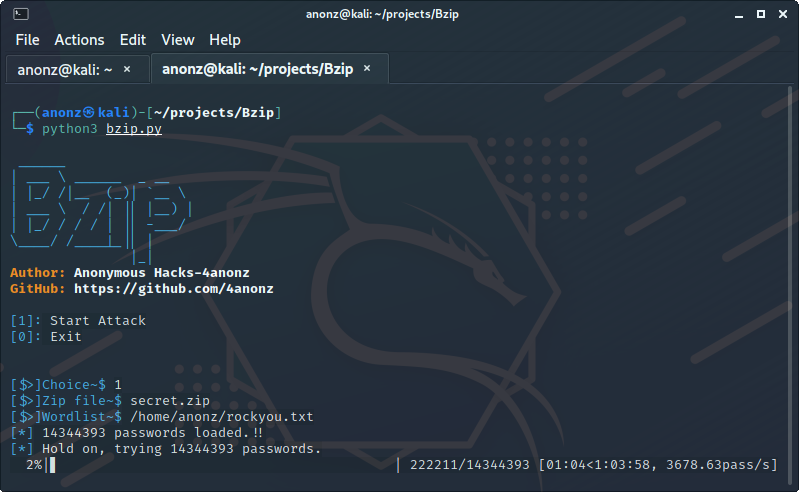
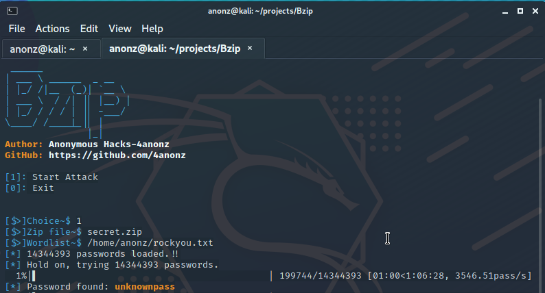

# Bzip
A brute force tool for password-protected zip file/folder(s).
Note that this tool can only crack .zip files.
Please DO not misuse.
# Installation
```
git clone https://github.com/4anonz/Bzip.git
cd Bzip
pip3 install -r requirements.txt
python3 bzip.py
```

# Screenshots


# Author
Anonymous Hacks - 4anonz
# FeedBack and Suggestions
Please report any bugs, or feed backs or suggestionts.
Send me <a href="mailto: digitalguru64@gmail.com" target="_blank">email</a>
